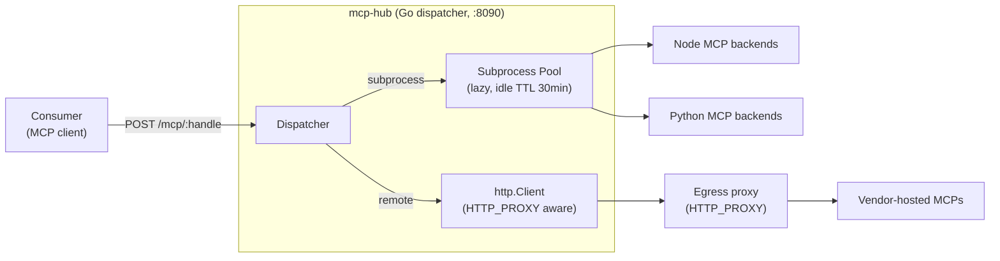

# mcp-hub

Unified gateway for MCP (Model Context Protocol) servers — a single HTTP endpoint that routes requests to either subprocess-hosted or vendor-hosted MCP backends.

## Contract with the consumer

**mcp-hub is a pure pass-through proxy.** The consumer sends the exact headers and body the target MCP expects. The hub does **no** credential translation, **no** i18n, **no** business logic — it only:

1. Resolves a public handle (`/mcp/<handle>`) to a backend (subprocess or remote URL).
2. Manages subprocess lifecycle (lazy spawn, idle TTL, graceful shutdown).
3. Filters `tools/list` responses and enforces per-handle `tools/call` allow-lists.
4. Exposes `/health` and `/mcp/<handle>/info` for discovery.

Any credential translation, field injection, or OAuth handling stays in the consumer.

## Architecture



## Development

```bash
make ci-setup   # one-time: install golangci-lint, gosec, goimports
make            # full pipeline: tidy + fmt + vet + lint + build + test
make docker     # build mcp-hub:local image
make validate-config  # validate config.yaml without starting the server
```

## Runtime configuration

See `config.yaml` at repo root. Schema:

```yaml
subprocesses:
  - name: <string>
    type: node | python
    port: <int>              # internal port the subprocess listens on
    cwd: <path>
    command: [<argv>...]
    env: {KEY: value}        # optional

remotes:
  - name: <string>
    url: <https url>

handles:
  <handle>:
    subprocess: <subprocess-name>   # XOR remote
    remote: <remote-name>           # XOR subprocess
    tools: [<tool-name>, ...]       # optional allow-list; empty = pass-through
```

## Adding a new MCP

1. If vendor-hosted: add an entry under `remotes:` and a handle under `handles:`.
2. If self-hosted: add an entry under `subprocesses:` (pins the command + port) and a handle that references it. An optional `tools` allow-list filters the shared subprocess's advertised tools down to what the handle exposes.
3. `make validate-config` to check.
4. Ship a new image tag via `./scripts/bump-version.sh`.

## License

MIT — see `LICENSE`.
