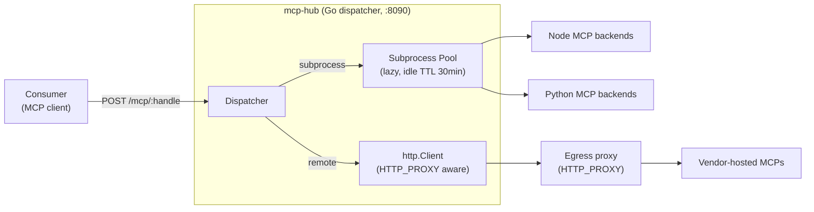

# mcp-hub

Unified gateway for MCP (Model Context Protocol) servers — a single HTTP endpoint that routes requests to either subprocess-hosted or vendor-hosted MCP backends.

> **No public image is published.** Build the Docker image yourself from
> this repo; there is no `ghcr.io/...` or `docker.io/...` registry entry
> to pull from. The `make docker` target produces `mcp-hub:local` on
> your machine. Retag and push to your own private registry if you want
> to deploy it elsewhere.

## Contract with the consumer

**mcp-hub is a pure pass-through proxy.** The consumer sends the exact headers and body the target MCP expects. The hub does **no** credential translation, **no** i18n, **no** business logic — it only:

1. Resolves a public handle (`/mcp/<handle>`) to a backend (subprocess or remote URL).
2. Manages subprocess lifecycle (lazy spawn, 30 min idle TTL, graceful shutdown).
3. Filters `tools/list` responses and enforces per-handle `tools/call` allow-lists.
4. Exposes `/health` and `/mcp/<handle>/info` for discovery.

Any credential translation, field injection, or OAuth handling stays in the consumer.

## Architecture



## Quick start

Four commands to get a running hub on your machine. **Both
`config.yaml` and `.env` are required** — `make docker` and `make run`
fail fast if either is missing.

```bash
# 1. Copy the shipped examples to your local files (both git-ignored).
cp config.example.yaml config.yaml
cp .env.example        .env

# 2. Edit config.yaml to keep only the handles you want and .env
#    to fill in the OAuth / API secrets for your subprocess backends.
$EDITOR config.yaml .env

# 3. Build the image. Your config.yaml is baked into the image at
#    build time — re-run this step whenever you change config.yaml.
make docker

# 4. Run it. .env is mounted at runtime (never baked into the image).
make run
```

Then from another terminal:

```bash
curl -s http://localhost:8090/health | jq
# {"status":"ok","version":"dev","handles":["asana","atlassian",...]}
```

Remote handles work out of the box (they need a valid vendor token
sent by the client). Subprocess-backed handles (`outlook*`,
`onedrive`, `sharepoint`, `ms-teams`, `ms-excel`, `google-drive`,
`gmail`, `google-calendar`) need their `MS365_*` / `GOOGLE_OAUTH_*`
env vars set in `.env` — see `OAUTH.md` for the per-provider app
registration guide.

## Building the image

```bash
make docker                         # tag: mcp-hub:local
make docker IMAGE=mcp-hub:2026-04   # or pick your own tag
```

To stamp a specific version string into `/health` responses:

```bash
docker build --build-arg VERSION=$(git describe --always --dirty) -t mcp-hub:local .
```

The image includes:

- The Go dispatcher (statically linked, ~15 MiB).
- Node 22 + `@softeria/ms-365-mcp-server` (pinned in `node/package.json`).
- Python 3.11 + `taylorwilsdon/google_workspace_mcp` (pinned commit in
  the `GWS_MCP_SHA` build arg of the Dockerfile).
- Your operator-owned `config.yaml` baked in at
  `/etc/mcp-hub/config.yaml`. The build fails if `config.yaml` is
  missing — `config.example.yaml` is committed as the starting point,
  never used directly.

Resulting image size: ~850 MiB.

## Running the image

`make run` wraps a standard `docker run` invocation:

```bash
docker run --rm -it \
  --name mcp-hub \
  -p 8090:8090 \
  --env-file .env \
  mcp-hub:local
```

Override the host port with `make run HOST_PORT=9999` or the image tag
with `make run IMAGE=mcp-hub:my-tag`.

For a compose-based deployment, the equivalent service fragment is:

```yaml
services:
  mcp-hub:
    image: mcp-hub:local
    build: .                         # config.yaml is baked in at build time
    restart: unless-stopped
    ports:
      - "8090:8090"
    env_file:
      - .env
    healthcheck:
      test: ["CMD", "curl", "-fsS", "http://localhost:8090/health"]
      interval: 30s
      timeout: 5s
      retries: 3
```

If you want to hot-reload the config without rebuilding, mount it on
top of the baked-in file:

```yaml
    volumes:
      - ./config.yaml:/etc/mcp-hub/config.yaml:ro
```

You then need to restart the container (the dispatcher does not watch
the config file).

## Configuration

Runtime routing lives in `config.yaml` (git-ignored, required at build
time). The committed `config.example.yaml` is the canonical reference —
it ships with 18 handles covering the two subprocess backends and nine
vendor-hosted remotes. Copy it to `config.yaml` and trim down to the
handles you actually want to expose.

Schema:

```yaml
subprocesses:
  - name: <string>
    type: node | python              # informational
    port: <int>                      # unique, not 8090
    path: <string>                   # upstream URL path, default /mcp
    cwd: <path>
    command: [<argv>...]
    env: {KEY: value}                # optional

remotes:
  - name: <string>
    url: <https url>                 # full URL including path

handles:
  <handle>:
    subprocess: <subprocess-name>    # XOR remote
    remote: <remote-name>            # XOR subprocess
    tools: [<tool-name>, ...]        # optional allow-list; empty = pass-through
```

Validate your local `config.yaml` without starting the server:

```bash
make validate-config
```

The target fails fast if `config.yaml` is missing — `config.example.yaml`
is never validated directly (the point of the example file is to be
copied and edited).

## Adding a new MCP

1. **Vendor-hosted (remote)**: add an entry under `remotes:` and a
   handle under `handles:`. Rebuild and restart.
2. **Self-hosted (subprocess)**: add a dependency in `node/` or follow
   the clone-in-Dockerfile pattern for `python/`. See
   [node/README.md](node/README.md) and [python/README.md](python/README.md)
   for step-by-step instructions. Then add a `subprocesses:` entry and
   a handle in `config.yaml`.

## Endpoints

| Method / Path | Purpose |
|---|---|
| `POST /mcp/<handle>` | Forward a JSON-RPC MCP request to the backend. |
| `GET\|POST /mcp/<handle>/info` | Discovery: synthesizes `tools/list`, filters by allow-list, returns `{handle, kind, tools}`. |
| `GET /health` | Liveness + build version + sorted handle list. |

The `/info` endpoint propagates upstream 4xx responses verbatim (so
`401 Missing credentials` bubbles up to the consumer), 5xx / malformed
JSON / JSON-RPC error envelopes become 502, and config-lookup failures
become 500.

## Development

```bash
make             # tidy + fmt + vet + lint + build + test
make test-race   # race-safe unit tests
make security    # gosec scan
make ci-setup    # one-time: install golangci-lint, gosec, goimports
```

The `.github/workflows/ci.yml` workflow runs `make ci` on every push
and pull request to `main`. No workflow publishes images to any public
registry; that is deliberate.

## License

MIT — see `LICENSE`.
